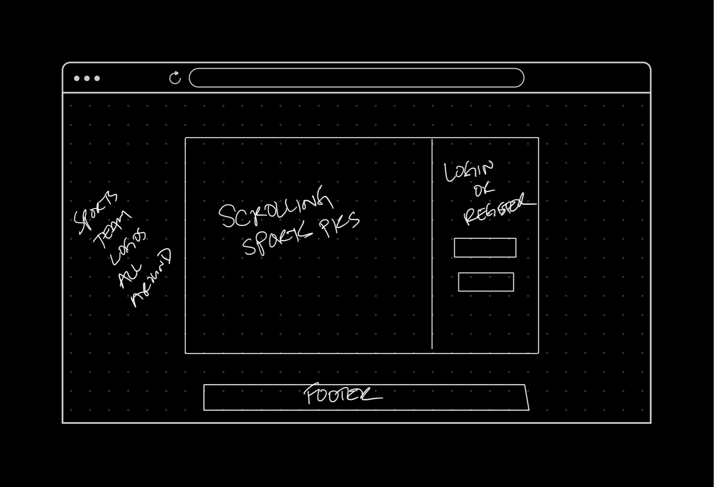
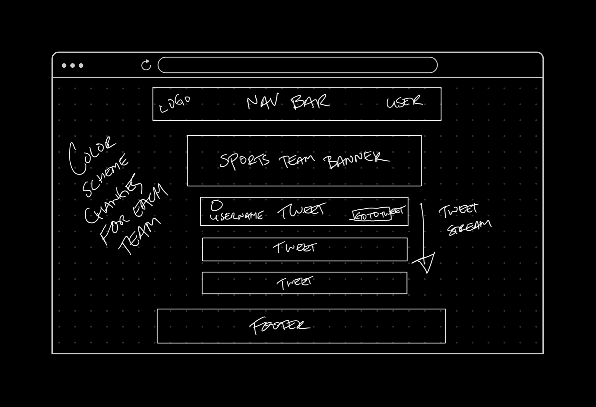
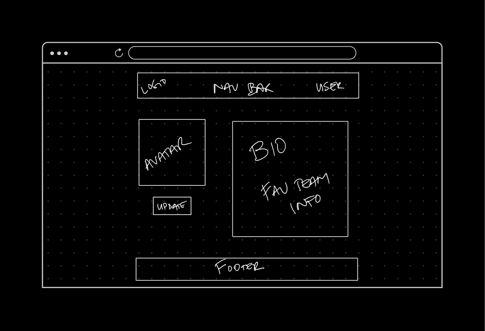
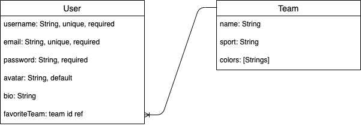

# Project-Sports-Tweets
by Dan Bae

# Scope/User Stories
Project Sports Tweets is an application for sports fans to get the most up to date info on a specific sports team straight from Twitter using the Twitter Api. Once the user signs up for access, they will be asked to create a profile with their basic information. One field that will be required is what their favorite sports team is. After they fill that out, they will be directed to a filtered stream of Twitter tweets about their favorite sports team and they can scrub through and read up all about the lastest news and thoughts about that team.

There will also be a button on each individual tweet so that the user could then go to that specific tweet on Twitter.com if they would like to interact with said tweet.

The user will be able to change team selection and choose within their profile to see all the tweets about whichever team they select and it will update their profile. Then they can go  back to the tweets show page with the new filtered stream of tweets.

# MVP
[x] Use a database - will be using MongoDB Atlas
[ ] Build a full-stack application - building a MERN app
[ ] Create a complete product - full CRUD functionality will be the users model
[ ] Create a focused product. Know which features are essential to build for your MVP and which to set aside for later.
[x] Craft thoughtful user stories that are significant enough to help you ensure a pleasing and logical user experience.
[ ] Handle errors gracefully, and provide useful feedback to users when errors or validation failures do occur.
[ ] Make a product that's impressive-looking; up your design and style game to kick your portfolio up a notch.
[ ] Deploy your application online

# Wireframes
Splash Page

Index/Show Page

Profile Page

# ERD

# Sprints
- Sprint 0
  - [x] Create server side file structure and initialize npm
  - [x] Create frontend application with `npx create-react-app`
  - [x] Split off into a development branch and start working
  - [x] Use Express Server Cheatsheet in Notion to connect server and set up database
  - [x] Run through Building a MERN app in Notion and set up some dummy twitter data to build initial UI components

- Sprint 1
  - [ ] Build User and Team models and schemas 
  - [ ] Connect Twitter Api to react front end
  - [ ] Build seed file for Team models
  - [ ] Create styles for each team

- Sprint 3
  - [ ] Set up auth using JWT
  - [ ] Set up JWT on front end
  - [ ] Set up error handling for sign up and sign in forms
  - [ ] Build login and register components for frontend

- Sprint 4
  - [ ] 

# Technologies
1. React
2. Express
3. MongoDB
4. Node.js
5. Twitter Api
6. Semantic UI React
7. Sass
8. Json Web Token